# Instal·lació i configuració de HamActivity Bridge a MacOS

Aquest document explica com instal·lar i configurar `HamActivity Bridge` en un ordinador amb MacOS.

## Requisits

Abans de començar, cal disposar de:

- un equip amb MacOS
- connexió a Internet
- una **API Key** de HamActivity

## 1. Descarregar l'aplicació

Accediu a la pàgina de publicacions del projecte:

<https://github.com/dacacioa/awardclient/releases>

Descarregueu l'arxiu corresponent a MacOS de l'última versió disponible. El nom del paquet serà similar a `hamactivity_bridge-mac-...`.

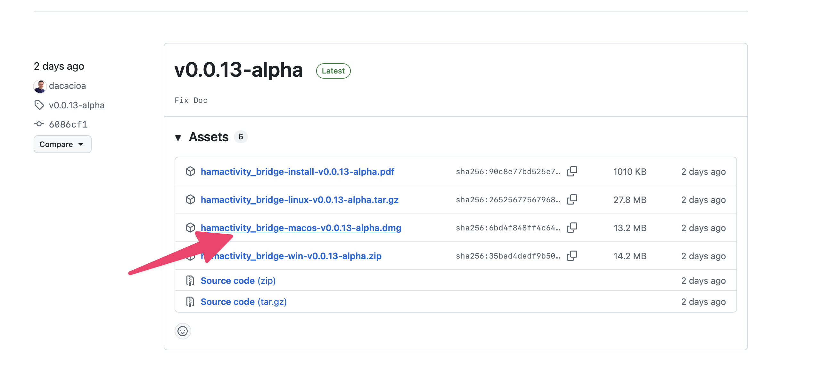

## 2. Obrir la imatge descarregade i moure l'arxiu d'aplicació a la carpeta d'aplicacions 

Feu doble clic sobre l'arxiu descarregat i copiar-ho a la carpeta d'aplicacions del vostre Mac

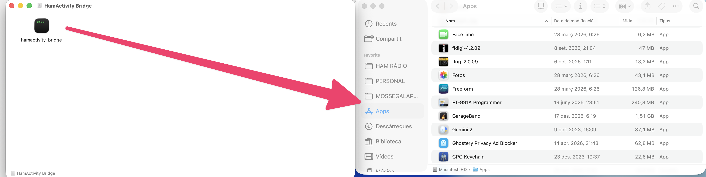

## 3. Executar HamActivity Bridge

Executeu (doble click) l'aplicació. El MacOS us mostrarà una finestra d'advertència:

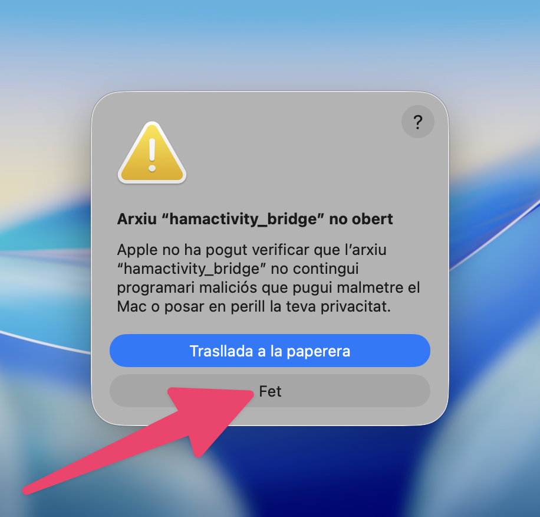

Premeu l'opció "Fet".
Ara aneu a Preferències del Sistema - Privacitat i Seguretat - Segueretat, i prémer en "Obre de tota manera"

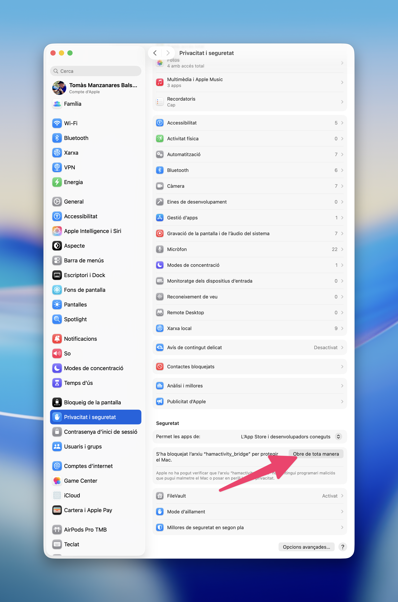

## 4. Tornar a executar l'aplicació

Quan executis l'aplicació per primer cop, un cop autoritzatda, et tornarà a sortir una finestra d'advertència. Selecciona "Prem de tota manera"

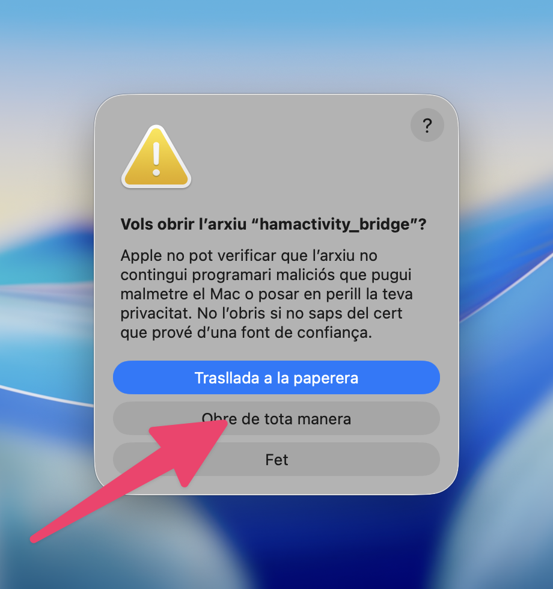

## 5. Comprovar les finestres obertes

En iniciar-se, l'aplicació obrirà 2 finestres:

- La primera una finstra del Terminal (no la tanquis durant l'execució de l'aplicació)

 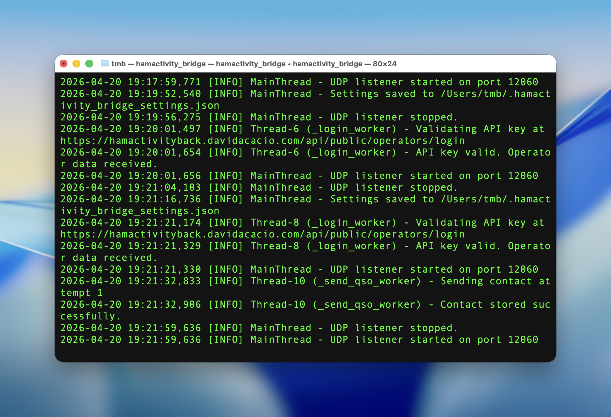 

- Uns segons més tard obrirà la  finestra principal de `HamActivity Bridge`

> Important: no tanqueu cap d'aquestes dues finestres mentre vulgueu que la passarel·la continuï en funcionament.

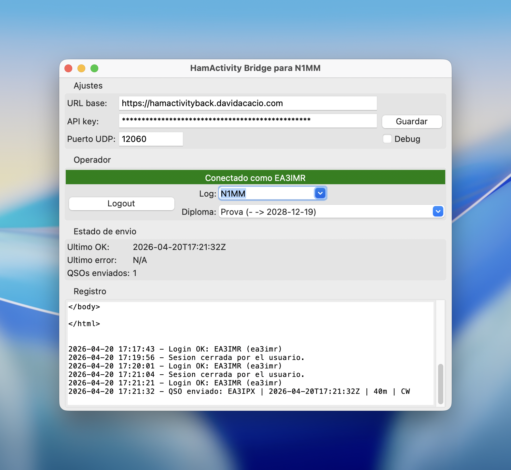

## 6. Introduir la configuració bàsica (per URCAT)

A la finestra principal, ompliu els camps següents:

- **URL base**: `https://activacionsbackend.urcat.cat`
- **API Key**: la vostra clau API, disponible a l'aplicació web de HamActivity mitjançant el botó **API Key** de la part superior dreta
- **Port UDP**: `12060` port per defecte en aplicacions de log com MacLoggerDX

Després d'introduir aquestes dades, premeu **Guardar**.

## 7. Iniciar sessió

Premeu **Login**. Si la configuració és correcta, l'aplicació mostrarà un missatge en verd indicant que la connexió s'ha establert correctament.

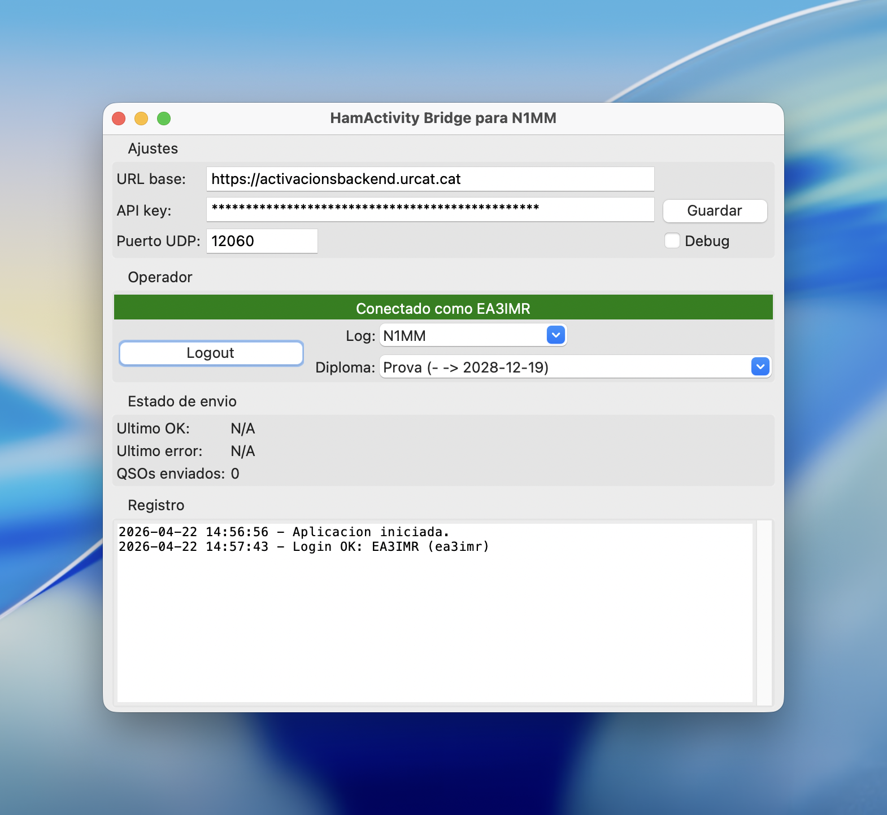

## 8. Revisar el diploma i el format de log

Comproveu que:

- el **diploma** seleccionat és el correcte
- el **format de log** és l'adequat, normalment `N1MM`

Si l'usuari només té assignat un diploma, aquest quedarà seleccionat automàticament.

## 9. Configurar el programa de log

Quan la sessió estigui iniciada i la configuració sigui correcta, ja podeu configurar el vostre programa de log perquè enviï els QSO a la passarel·la.

## Configuració de MacLoggerDX

Si treballeu amb `MacLoggerDX`, configureu l'enviament UDP de la manera següent:

1. Aneu a **Settings** / **Preferències**
2. Aneu a la pestanya **Station**.
3. Activeu l'opció **N1MM UDP**.

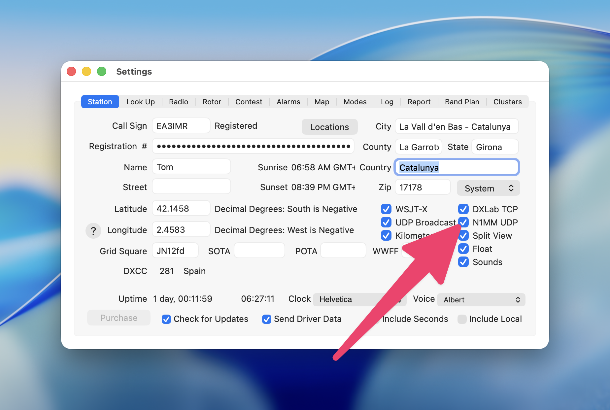

## Configuració de RumlogNG

Si treballeu amb `RumlogNG`, configureu una sortida UDP amb aquests valors:

1. Aneu a **Settings** / **Preferències**
2. Aneu a la pestanya **UDP**
3. Configureu una opció per "Contact Info N1MM" amb aquests valors:
   - **Contac Info N1MM**
   - **Host**: `127.0.0.1` (ip local)
   - **Port**: `12060`
5. Deseu la configuració prement l'opció "Close" a la part inferior dreta de la finestra de configuració

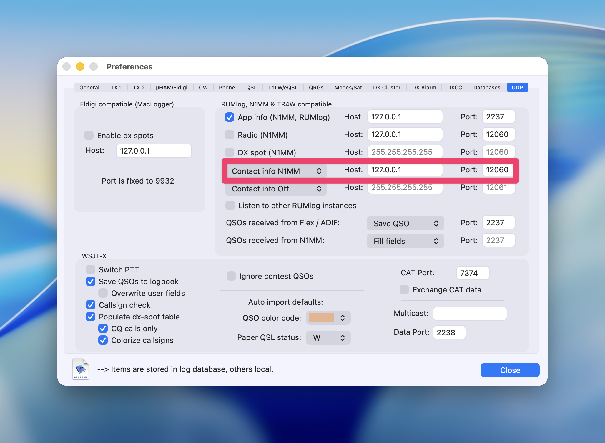

## Verificació de recepció

Quan el programa de log estigui correctament configurat i envieu un QSO, aquest hauria d'aparèixer al registre de `HamActivity Bridge` com a enviat correctament.

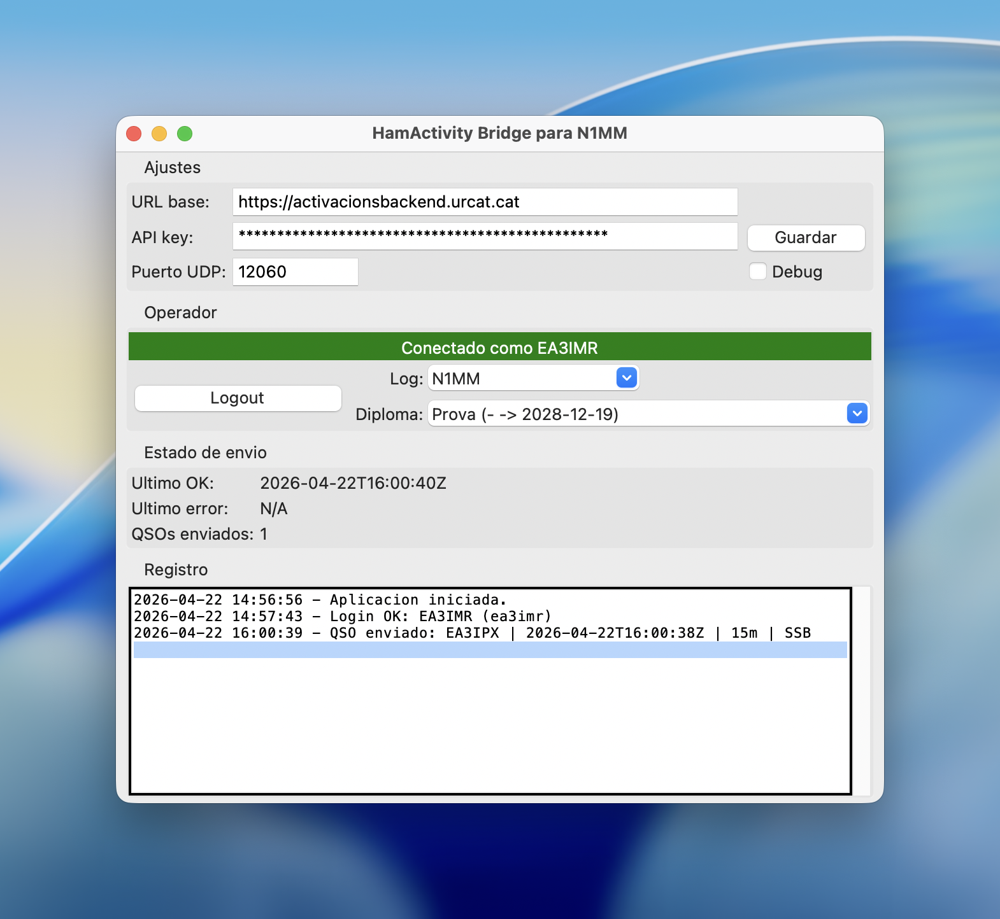

## Notes

- Si canvieu la configuració de xarxa o el port UDP, deseu els canvis abans de continuar.
- Si tanqueu la sessió amb **Logout**, la recepció de dades UDP s'aturarà fins que torneu a fer **Login**.
- Per a `MacLoggerDX` i `RumlogNG`, el format de log recomanat a `HamActivity Bridge` és `N1MM`.
