# Instal·lació i configuració de HamActivity Bridge a Windows

Aquest document explica com instal·lar i configurar `HamActivity Bridge` en un ordinador amb Windows.

## Requisits

Abans de començar, cal disposar de:

- un equip amb Windows
- connexió a Internet
- una **API Key** de HamActivity

## 1. Descarregar l'aplicació

Accediu a la pàgina de publicacions del projecte:

<https://github.com/dacacioa/awardclient/releases>

Descarregueu l'arxiu corresponent a Windows de l'última versió disponible. El nom del paquet serà similar a `hamactivity_bridge-win-...`.

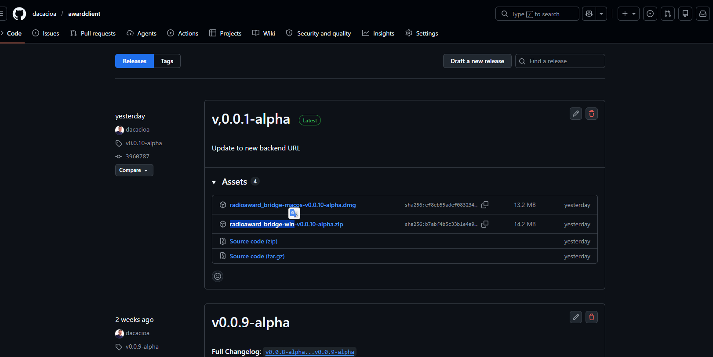

## 2. Extreure el paquet

Feu doble clic sobre l'arxiu descarregat i extreieu-ne el contingut a l'escriptori o a la carpeta on vulgueu deixar l'aplicació.

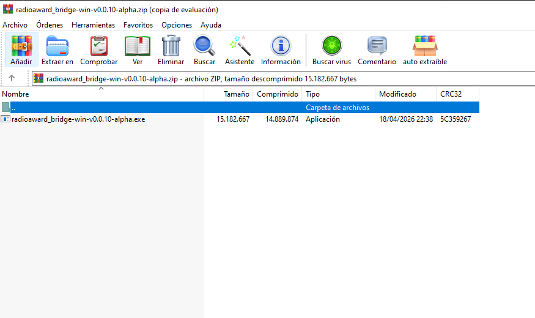

## 3. Executar HamActivity Bridge

Obriu l'executable inclòs dins del paquet extret. Si Windows mostra algun avís de seguretat, confirmeu-ne l'execució (pulseu `Mas informacion` -> `Ejecutar de todas formas`)
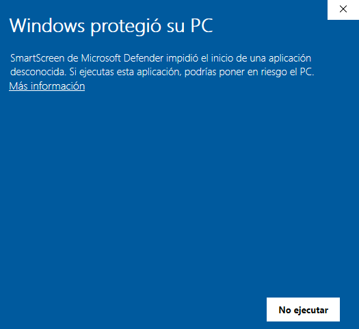

## 4. Permetre l'accés al tallafoc

Si Windows demana autorització per permetre les comunicacions de l'aplicació, marqueu les opcions disponibles i premeu **Permetre l'accés**.

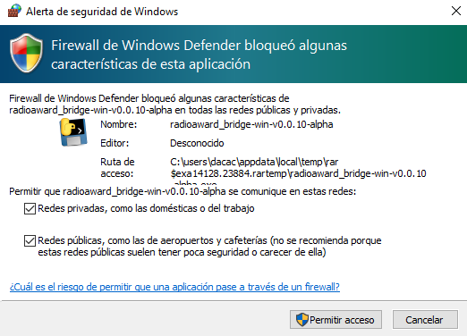

## 5. Comprovar les finestres obertes

En iniciar-se, l'aplicació pot obrir:

- una finestra de consola negra
- la finestra principal de `HamActivity Bridge`

> Important: no tanqueu cap d'aquestes dues finestres mentre vulgueu que la passarel·la continuï en funcionament.

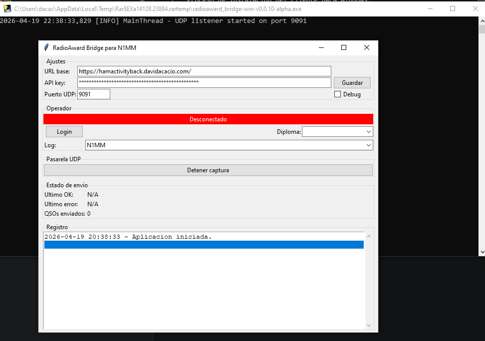

## 6. Introduir la configuració bàsica

A la finestra principal, ompliu els camps següents:

- **URL base**: `https://activacionsbackend.urcat.cat`
- **API Key**: la vostra clau API, disponible a l'aplicació web de HamActivity mitjançant el botó **API Key** de la part superior dreta
- **Port UDP**: `9091` per defecte; només cal canviar-lo si el vostre entorn ho requereix

Després d'introduir aquestes dades, premeu **Guardar**.

## 7. Iniciar sessió

Premeu **Login**. Si la configuració és correcta, l'aplicació mostrarà un missatge en verd indicant que la connexió s'ha establert correctament.

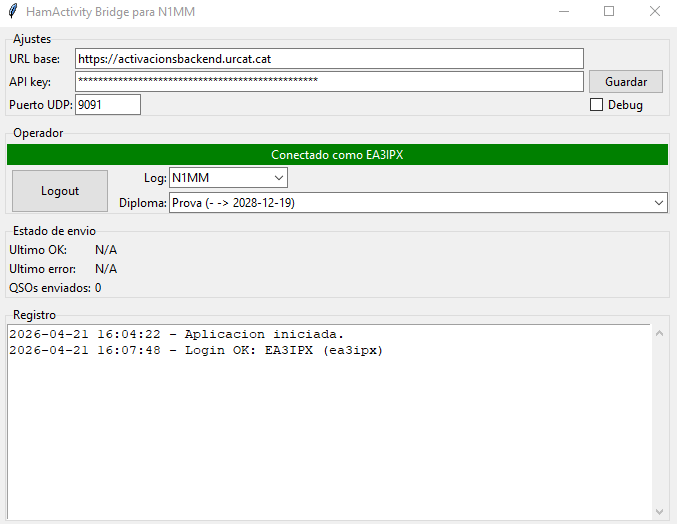

## 8. Revisar el diploma i el format de log

Comproveu que:

- el **diploma** seleccionat és el correcte
- el **format de log** és l'adequat: `N1MM` per a N1MM/Log4OM o `WSJT-X/JTDX` per a JTDX/WSJT-X

Si l'usuari només té assignat un diploma, aquest quedarà seleccionat automàticament.

## 9. Configurar el programa de log

Quan la sessió estigui iniciada i la configuració sigui correcta, ja podeu configurar el vostre programa de log perquè enviï els QSO a la passarel·la.

## Configuració de N1MM

Si treballeu amb `N1MM`, configureu l'enviament UDP de la manera següent:

1. Obriu `Config`.
2. Entreu a `Configure Ports, Mode Control, Winkey, etc...`.
3. Aneu a la pestanya **Broadcast Data**.
4. Activeu l'opció **Contacts**.
5. A l'adreça de destinació, indiqueu `127.0.0.1:9091`.
6. Deseu la configuració amb **OK**.

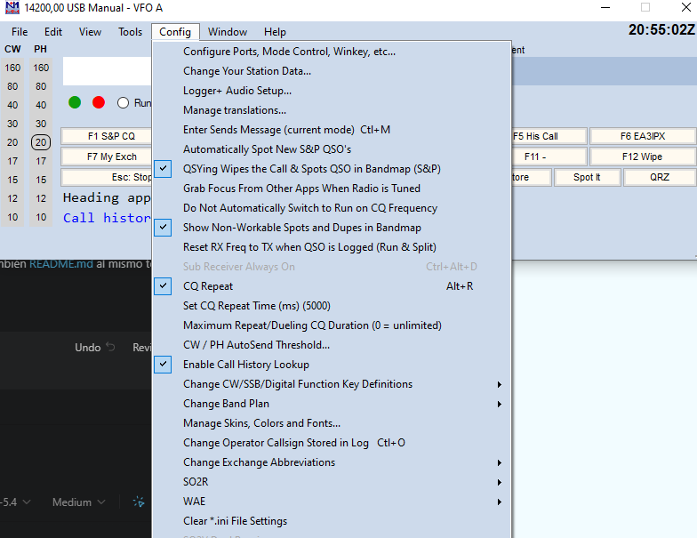

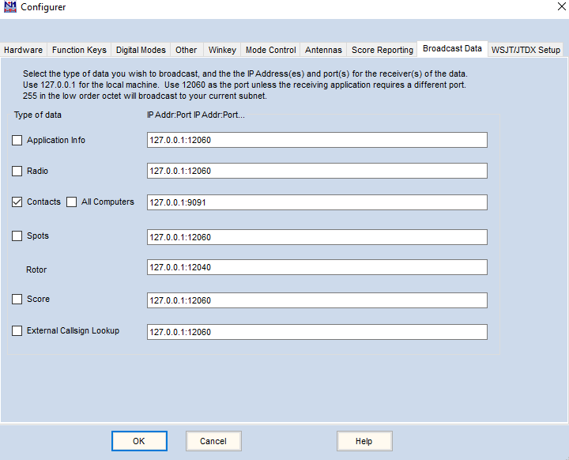

## Configuració de Log4OM

Si treballeu amb `Log4OM`, configureu una sortida UDP amb aquests valors:

1. Aneu al menú `Settings` -> `Program Configuration`.
2. A la finestra de configuració, entreu a `Connections`.
3. A l'apartat **UDP OUTBOUND**, creeu una connexió nova.
4. Configureu-la amb aquests valors:
   - **Port**: `9091`
   - **Connection name**: `HAMACTIVITY`
   - **Service type**: `N1MM_CONTACT`
   - **Destination IP Address**: `127.0.0.1`
5. Deseu la configuració.

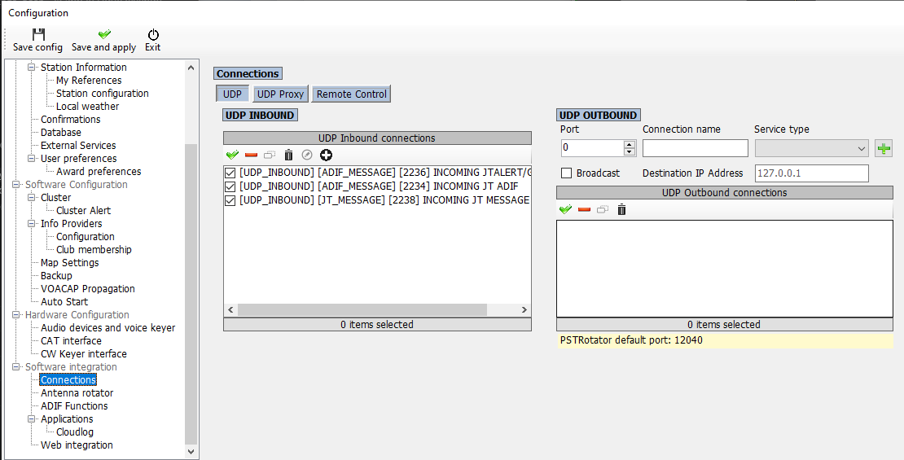

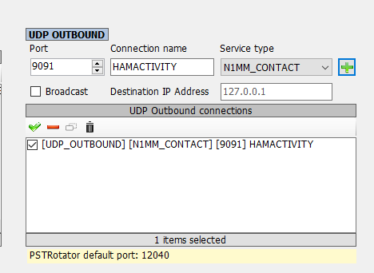

## Configuració de SWISSLOG

Si treballeu amb `SWISSLOG`, configureu `HamActivity Bridge` amb el format de log `N1MM`.

A `SWISSLOG`, configureu el llibre de guàrdia en línia de la manera següent:

1. Obriu el menú `Opciones`.
2. Entreu a `Libros Online`.
3. A la finestra de configuració, aneu a la pestanya **UDP**.
4. Activeu l'opció **Subir QSO automáticamente al guardar QSO (guardar en tiempo real)**.
5. Activeu l'opció **Formato N1MM XML**.
6. Deixeu desactivada l'opció **Formato ADIF**.
7. Configureu els camps de connexió amb aquests valors:
   - **Dirección IP**: `127.0.0.1`
   - **Puerto**: `9091`
8. Deseu la configuració amb **Aceptar**.

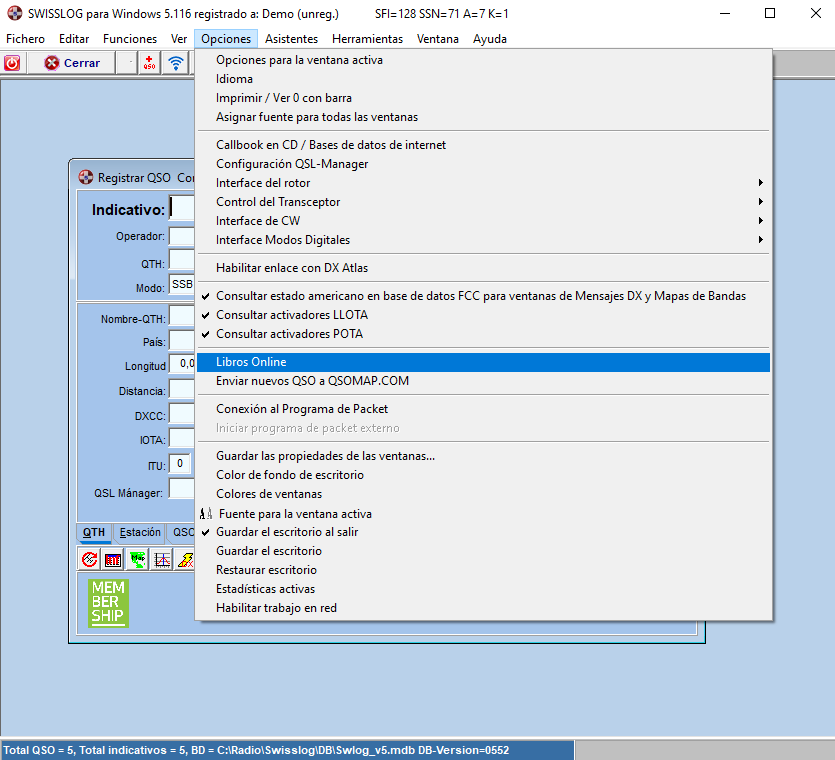

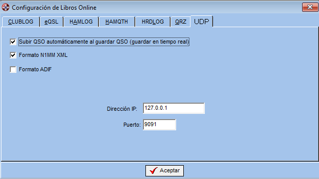

## Configuració de JTDX

Si treballeu amb `JTDX`, configureu `HamActivity Bridge` amb aquests valors:

1. Seleccioneu el perfil de log `WSJT-X/JTDX`.
2. Premeu **Guardar**.

A JTDX, configureu l'enviament UDP de la manera següent:

1. Obriu `Archiu - Configuracions`.
2. Aneu a la pestanya **Informes**.
3. A l'apartat **Servidor UDP primari**, indiqueu:
   - **Servidor UDP**: `127.0.0.1`
   - **Número del port del servidor UDP**: `9091`
4. Activeu l'opció **Habilita l'enviament de log de dades de QSO's en format ADIF**.
5. Manteniu marcada l'opció **Evita detectar missatges amb els indicatius no confirmats a través d'UDP**.
6. Deseu la configuració amb **Acceptar**.

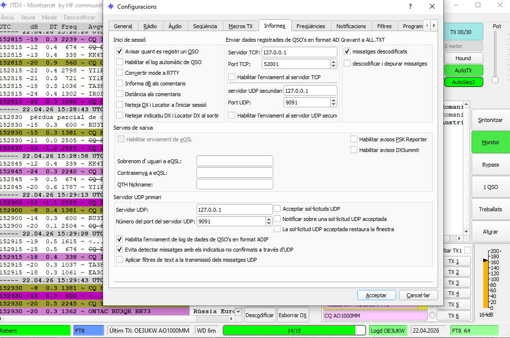

## Configuració de WSJT-X

Si treballeu amb `WSJT-X`, configureu `HamActivity Bridge` amb aquests valors:

1. Seleccioneu el perfil de log `WSJT-X/JTDX`.
2. Premeu **Guardar**.

A WSJT-X, configureu el servidor UDP de la manera següent:

1. Obriu `Archivo` -> `Ajustes`.
2. Aneu a la pestanya **Reportes**.
3. A l'apartat **Servidor UDP**, indiqueu:
   - **Servidor UDP**: `127.0.0.1`
   - **Número de puerto del servidor UDP**: `9091`
4. Deseu la configuració amb **Aceptar**.

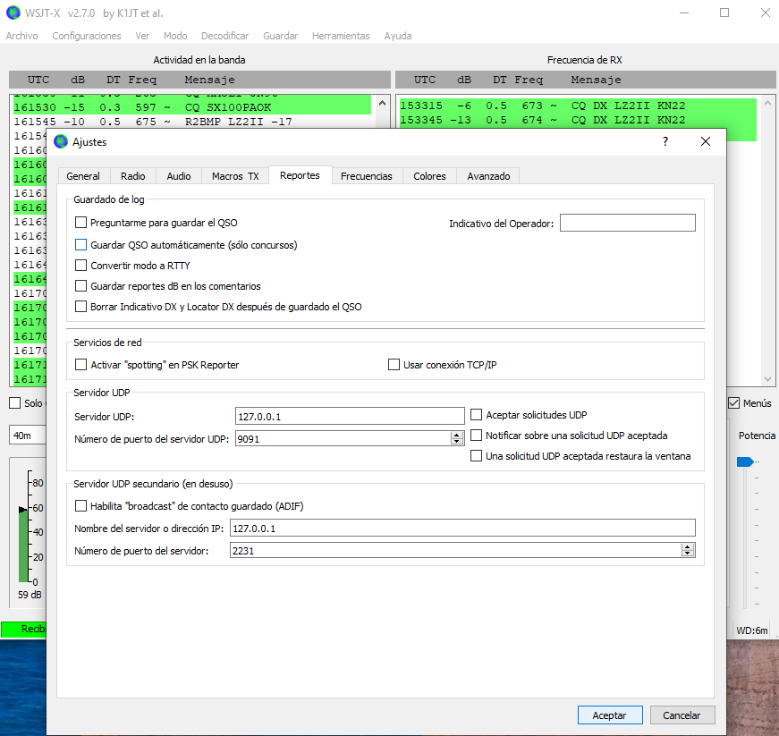

## Verificació de recepció

Quan el programa de log estigui correctament configurat i envieu un QSO, aquest hauria d'aparèixer al registre de `HamActivity Bridge` com a enviat correctament.

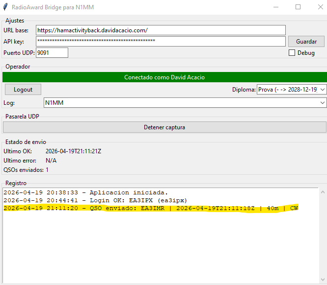

## Notes

- Si canvieu la configuració de xarxa o el port UDP, deseu els canvis abans de continuar.
- Si tanqueu la sessió amb **Logout**, la recepció de dades UDP s'aturarà fins que torneu a fer **Login**.
- Per a `N1MM`, `Log4OM` i `SWISSLOG`, el format de log recomanat a `HamActivity Bridge` és `N1MM`.
- Per a `JTDX` i `WSJT-X`, el format de log recomanat és `WSJT-X/JTDX`.
