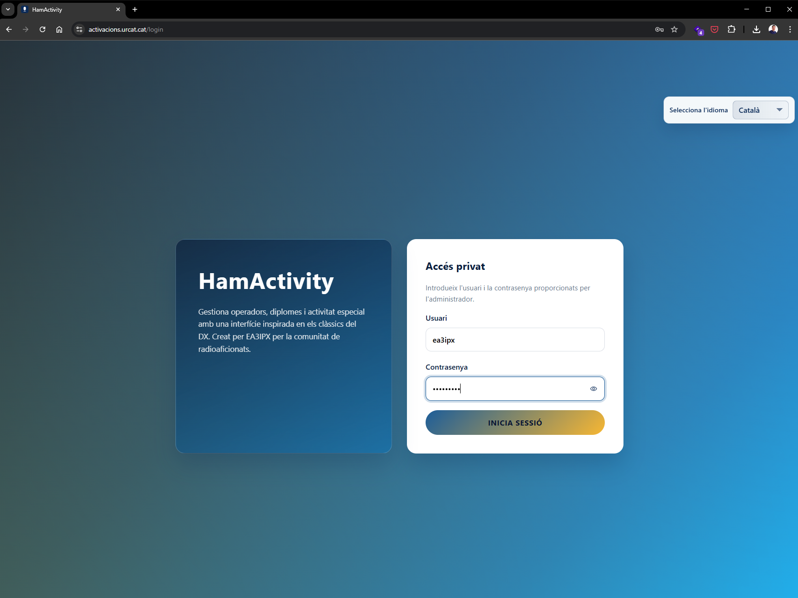
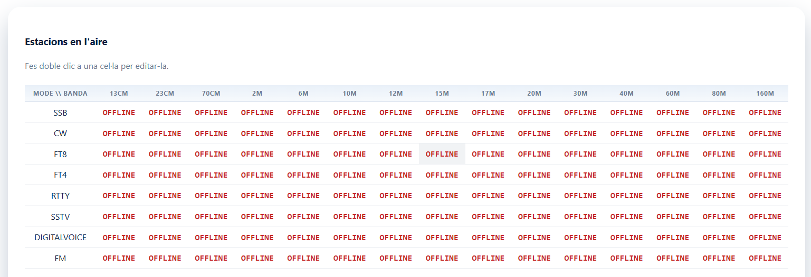
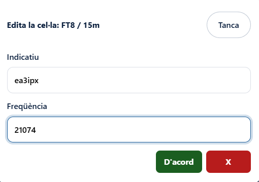
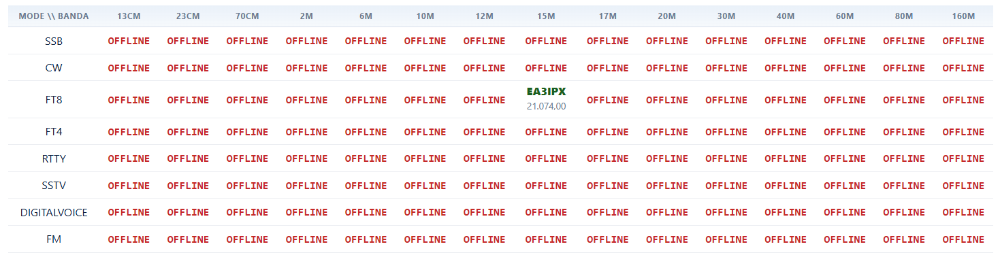
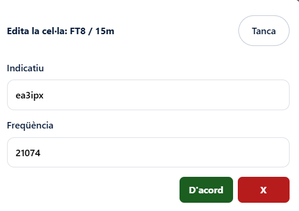
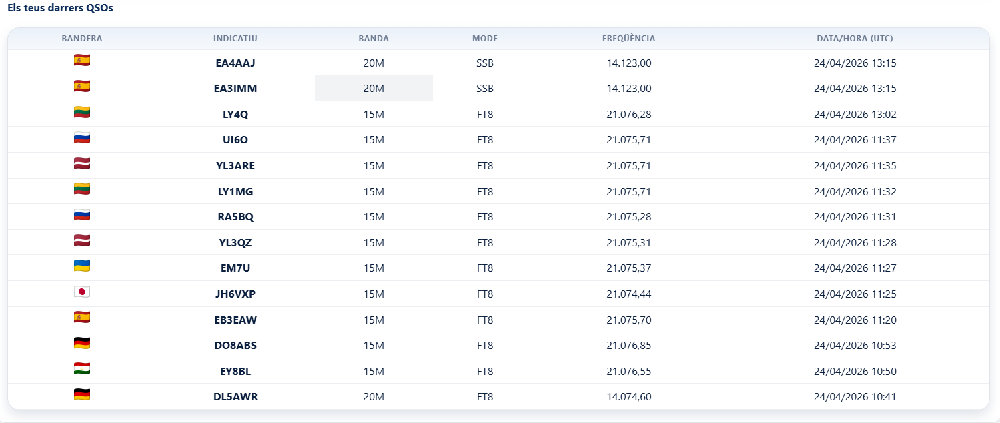
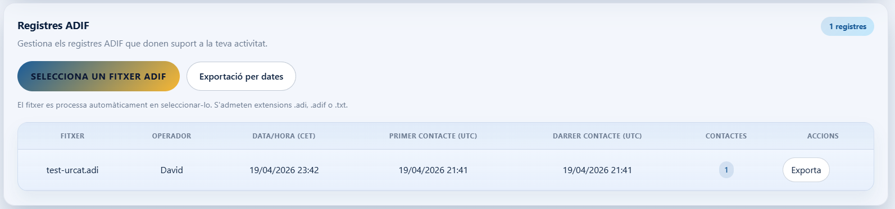
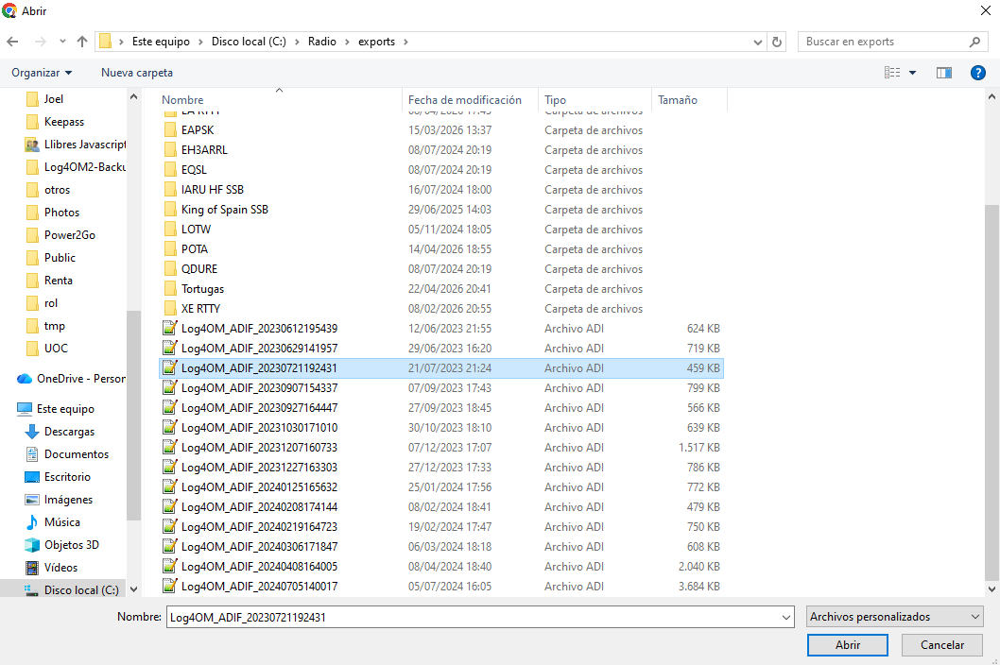
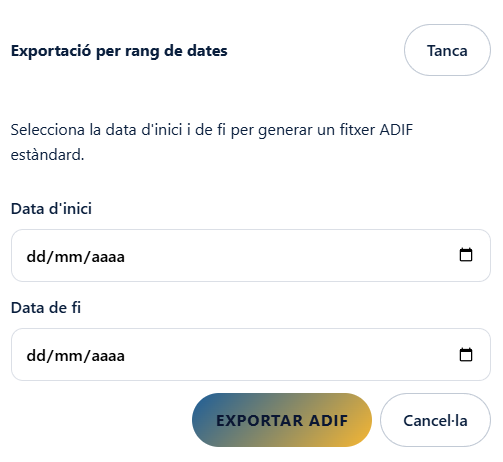

# Manual d'operador

Aquest document explica les accions bàsiques que ha de conèixer un operador dins de HamActivity:

- iniciar sessió
- registrar una freqüència de treball
- treure's d'una freqüència de treball
- comprovar que el `livestream` funciona
- importar un fitxer ADIF
- exportar un fitxer ADIF

## 1. Iniciar sessió

1. Obre l'adreça de la plataforma que t'hagi facilitat l'administrador.
2. Si cal, selecciona l'idioma a la part superior dreta.
3. Introdueix el teu usuari al camp `Usuari`.
4. Introdueix la teva contrasenya al camp `Contrasenya`.
5. Fes clic a `INICIA SESSIÓ`.

## 2. Registrar una freqüència de treball

La taula `Estacions en l'aire` serveix per indicar en quina banda i mode estàs actiu.

1. Localitza la fila del mode i la columna de la banda on treballaràs.
2. Fes doble clic a la cel·la corresponent.

3. A la finestra `Edita la cel·la`, comprova que el teu indicatiu és correcte.
4. Escriu la freqüència de treball al camp `Freqüència`.
5. Fes clic a `D'acord`.

6. Verifica que la cel·la deixa d'estar en `OFFLINE` i mostra el teu indicatiu i la freqüència.

## 3. Treure's d'una freqüència de treball

Quan deixis d'operar en una banda o mode, convé alliberar la cel·la.

1. Fes doble clic sobre la teva cel·la activa.
2. A la finestra `Edita la cel·la`, fes clic al botó vermell `X`.
3. Comprova que la cel·la torna a aparèixer com a `OFFLINE`.

## 4. Comprovar que funciona el livestream

El bloc `Els teus darrers QSOs` et permet validar ràpidament que els contactes s'estan registrant.

1. Fes un QSO des del teu sistema habitual.
2. Espera uns segons perquè la plataforma actualitzi la informació.
3. Revisa el bloc `Els teus darrers QSOs`.
4. Comprova que apareix una nova fila amb:
   - l'indicatiu treballat
   - la banda
   - el mode
   - la freqüència
   - la data i hora

Si el contacte nou apareix en aquesta taula, el flux de dades està arribant correctament al `livestream`.

## 5. Importar un fitxer ADIF

El bloc `Registres ADIF` serveix per pujar fitxers amb contactes ja registrats.

1. Ves a l'apartat `Registres ADIF`.
2. Fes clic a `SELECCIONA UN FITXER ADIF`.
3. Selecciona el fitxer des del teu ordinador.
4. Fes clic a `Abrir` o `Obre` a la finestra del sistema.
5. Espera que el fitxer es processi automàticament.
6. Comprova que el registre apareix a la taula inferior.

Formats admesos: `.adi`, `.adif` i `.txt`.

## 6. Exportar un fitxer ADIF

Hi ha dues maneres d'exportar dades.

### Exportar un fitxer ja importat

1. Ves a `Registres ADIF`.
2. Localitza el registre que vols descarregar.
3. Fes clic a `Exporta`.

### Exportar per rang de dates

1. Ves a `Registres ADIF`.
2. Fes clic a `Exportació per dates`.
3. Introdueix `Data d'inici`.
4. Introdueix `Data de fi`.
5. Fes clic a `EXPORTAR ADIF`.

## 7. Recomanacions d'ús

- Mantén actualitzada la cel·la d'`Estacions en l'aire` mentre estiguis operant.
- Quan acabis, elimina la teva freqüència per no mostrar una activitat que ja no és real.
- Si puges un ADIF, comprova després que el registre apareix a la llista.
- Si no veus un QSO recent al `livestream`, revisa primer si la freqüència, el mode i la font de dades són correctes.
